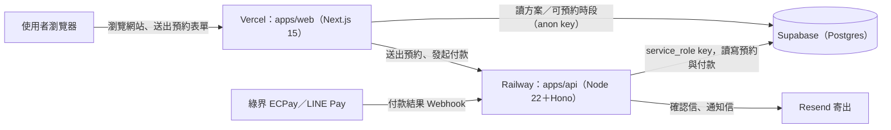

# 緣舍命理 — 預約網站

一對一線上命理諮詢（紫微斗數 × 八字）的預約與收款網站。

- 正式網站：**https://yuanshe.vercel.app**
- API 健康檢查：**https://api-production-2a39.up.railway.app/health**（正常會回 `{"ok":true,...}`）

> 本文件第 1–5 節給不寫程式的網站主人看（push 之後會發生什麼、文案和價格怎麼改、正式上線前還缺什麼）；第 6–10 節給接手的工程師看。

## 1. 這是什麼

訪客在網站上選方案、選時段、填排盤資料、線上付款，付款完成即確認預約；老師端目前沒有介面，時段與方案的調整都在 Supabase 後台完成（見下面各節）。

## 2. 架構



三個服務：

- **Vercel（`apps/web`）**：Next.js 15 網站本身（首頁、方案、老師介紹、FAQ、預約流程）。只用 Supabase 的 anon key 讀「方案」與「可預約時段」，不碰預約與付款資料。
- **Railway（`apps/api`）**：Node 22 + Hono 寫的 API，用 Docker 部署（`apps/api/Dockerfile`）。負責建立預約、串接綠界／LINE Pay、接收付款結果 Webhook、寄確認信、定期釋出逾時未付款的時段。用 Supabase 的 service_role key，會繞過資料庫的 RLS 限制。
- **Supabase（Postgres）**：存方案、每週時段、公休／加開例外、預約、付款紀錄。完整資料表定義見 `supabase/migrations/0001_init.sql`；`apps/web` ↔ `apps/api` 的完整 API 合約見 `docs/API.md`。

## 3. Push 之後會發生什麼事

**給網站主人的一句話版本**：push 到 GitHub 的 `main` 分支後，幾分鐘內網站與 API 會自動更新；想看進度或結果，到這個 repo 的 **Actions** 分頁點最新一次執行紀錄。

**細節**（見 `.github/workflows/ci-cd.yml`）：

1. **CI**：`pnpm install` → `pnpm lint` → `pnpm typecheck` → `pnpm test` → `pnpm build`。任何一步失敗，後面全部不會執行。
2. **判斷部署範圍**：比對這次 push 改了哪些檔案，分成三類——`supabase/migrations/**` 算「db」、`apps/api/**`（含 `package.json`／`pnpm-lock.yaml`／`pnpm-workspace.yaml`／`.dockerignore`）算「api」、`apps/web/**`（含前三個共用檔）算「web」。**只有真的改到的部分才會重新部署**，例如只改網站文案不會觸發 API 重新部署。
3. **資料庫 migration**：`supabase/migrations/**` 有變動才會跑，用 Supabase CLI 執行 `supabase db push` 把新的 migration 套用到正式資料庫。
4. **部署 API**：`apps/api/**` 有變動才會跑。`railway up` 部署後會每 15 秒打一次 `/health`，比對回傳內容是否含這次的 commit SHA，最多等 10 分鐘，等不到視為部署失敗。
5. **部署網站**：`apps/web/**` 有變動才會跑，且一定排在 API 部署之後。`vercel deploy --prod` 完成後會做一次「冒煙測試」：打首頁確認回 HTTP 200 且頁面裡有「緣舍命理」四個字。

執行順序固定是「資料庫 migration → API → 網站」，且只部署真的有變動的部分。另外兩種情況：

- **Pull request**：只會跑第 1 步 CI（lint／typecheck／test／build），不會 migration、不會部署，用來在合併前先確認程式碼沒壞。
- **手動執行**（Actions → CI/CD → Run workflow）：CI 通過後，migration、API、網站**三個會全部重新部署**，不管有沒有改到對應的檔案。想在沒改 code 的情況下重新套用環境變數、重啟服務，就用這個。

## 4. 常見修改怎麼做

**改網站文案**
- 全站共用設定（站名、SEO 描述、導覽選單、人物圖路徑）：`apps/web/lib/site.ts`
- 首頁四步驟、學員心得、老師頁時間軸／諮詢原則／標籤、FAQ 五題、頁尾項目：`apps/web/lib/content.ts`
- 四個方案的文字與價格「備援資料」：`apps/web/lib/services.ts`（正式資料在 Supabase，見下一段）
- 部分文案直接寫在頁面檔裡（例如首頁 Hero 標題「問一個人的命／答一段路的解」），不是每一句都能在上面三個檔案裡找到，要改的話搜尋 `apps/web/app/(site)/` 與 `apps/web/app/booking/` 底下對應的 `page.tsx`

**改方案價格與內容**
- 正式資料在 Supabase 的 **`services`** 表（`name`／`short_name`／`minutes`／`price`／`tagline`／`description`／`includes`／`is_featured`／`sort`／`active` 欄位），直接在 Supabase 後台改這張表即可，不用改程式碼、不用重新部署。
- 網站前台會快取約 **5 分鐘**（`apps/web/lib/services.ts` 的 `getServices()`），改完 Supabase 後最多等 5 分鐘網站才會顯示新內容。
- API 建立預約時，金額**一律以 Supabase `services.price` 為準**（`apps/api/src/routes/bookings.ts` 內註明「金額一律取 DB services.price」），不會採信前端送過來的金額，所以改了 DB 價格，實際收費也會跟著改，兩邊不會對不上。
- `apps/web/lib/services.ts` 裡還有一份 `SVCS` 常數，是網站讀不到 Supabase（沒設環境變數、逾時、或資料格式不對）時的備援文案／價格，目前內容與 `supabase/seed.sql`＋`0004` migration 的初始值一致，但只是「網站不要壞掉」用的保險，不是價格的正式來源。

**自選主題（依題數計價）**
- 每個價位是 `services` 表的一列（`topics-4`／`topics-6`／`topics-8`／`topics-15`），`topic_limit` 是這個價位最多幾題：選 n 題就用 `topic_limit ≥ n` 最小的那一列的 `price` 與 `minutes`；**最少要選幾題 = 啟用中價位裡最小的 `topic_limit`**（目前 4 題）。
- 改價格／時間：直接改那一列的 `price`／`minutes`。想開放 2 題 NT$1,000：新增一列 `topic_limit = 2`（`short_name` 同樣填「自選主題」），最少題數就會自動變成 2 題。
- 網站把這幾列合成一張「自選主題」方案卡（卡片名稱用 `short_name`、說明用最低價位的 `tagline`／`description`）；15 個主題的文字在 `apps/web/lib/topics.ts`。
- 客人勾選的主題（依優先順序）、備註、想問的問題會一起存進預約的 `questions`，老師的新訂單通知信看得到。

**問題欄必填的方案（接住你的諮詢室）**
- `services` 表的 `question_label` 是預約 Step 3 問題欄的標題（空的用預設「想問的問題」），`question_required = true` 時必填。`listen`（接住你的諮詢室）目前是「這次的煩惱是什麼？」且必填。

**網站後台（`/admin`）**
- 網址：`https://yuanshe.vercel.app/admin`。只有管理者名單內的 Email 能用（名單在 Supabase 的 `admins` 表，存的是 Email 的 sha256，repo 是公開的所以不放明碼）。
- 第一次使用：在登入頁按「第一次使用：設定密碼」→ 到信箱點確認連結 → 回到登入頁用 Email＋密碼登入。忘記密碼可在登入頁寄重設信。
- 確認信／重設信的連結要能回到網站，需在 Supabase 後台 **Authentication → URL Configuration** 設定：Site URL 填正式網址，Redirect URLs 加入 `<正式網址>/admin/login`。沒設定時連結會打開錯誤頁面，但帳號仍會完成確認，直接回登入頁登入即可。
- 目前功能：接下來 7 天的預約總覽、預約列表（日期／狀態篩選、顧客資料與問題、下載 CSV）、KOL 推薦碼。

**KOL 推薦碼（後台「推薦碼」）**
- 先新增 KOL，再幫他建立推薦碼：打折（折扣 %，10 = 打 9 折）或折抵金額、KOL 佣金 %（以折扣後實付金額計算）、適用範圍（預約／VIP／商店）、有效期間與可用次數都可以設定，隨時可停用。
- 「複製分享連結」給 KOL（`網址/?ref=代碼`），客人點進來後 30 天內結帳會自動帶入；也可以在付款步驟自己輸入。
- 金額一律由 API 依資料庫設定重算，前端顯示的折扣只是預覽。可用次數只算已付款或還在保留中的訂單。
- 「推薦成效與佣金」依月份統計每位 KOL 的成交筆數、成交金額、折扣與應付佣金（只算已付款），可下載明細 CSV。

**公休／請假／加開時段**
- Supabase 的 **`date_overrides`** 表，主鍵是 `date`（單一日期）：`closed = true` 表示當天公休或請假；`extra_times` 是當天加開的時段陣列。直接在 Supabase 後台新增／編輯這張表的資料列。

**每週固定時段**
- Supabase 的 **`weekly_slots`** 表：`weekday`（0=日 … 6=六）＋ `start_time`。目前預設是週二～週日 `10:00／13:30／15:30／19:00／20:30`，**週一不建資料＝固定公休**。要調整固定班表就直接改這張表。

**換人物照片**
- `apps/web/lib/site.ts` 的 `HERO_IMAGE`／`TEACHER_IMAGE`：目前指向 `apps/web/public/images/hero-placeholder.svg` 與 `teacher-placeholder.svg`（都是 SVG 佔位圖，不是真人照片）。換圖流程：把新圖放進 `apps/web/public/images/`，再把這兩個常數改成新檔名即可。

## 5. 正式對外開放前的待辦清單

- [ ] **換成綠界正式特店**：Railway 的 `apps/api` 服務要設定 `ECPAY_ENV=prod`，並把 `ECPAY_MERCHANT_ID`／`ECPAY_HASH_KEY`／`ECPAY_HASH_IV` 換成緣舍命理自己申請的正式特店資訊。**現況用的是綠界官方公開發布的測試特店**（任何人都查得到對應金鑰），代表現在任何人都能偽造一筆「付款成功」通知——**對外開放前必換**。
- [ ] **開通 LINE Pay**：設定 `LINEPAY_ENV`／`LINEPAY_CHANNEL_ID`／`LINEPAY_CHANNEL_SECRET`。這三個變數只要沒設定，前台 LINE Pay 選項就會自動顯示「即將開放」並停用，不是壞掉。
- [ ] **接上正式寄信**：到 Resend 驗證寄件網域，設定 `RESEND_API_KEY`、`MAIL_FROM`（必須是已驗證網域的寄件地址）。這兩個沒設之前，系統只會「記錄」要寄的信（收件網域＋主旨），不會真的寄出，預約流程本身不受影響。另外兩個相關變數：`ADMIN_EMAIL`（老師收新訂單與異常通知的信箱，可逗號分隔多個）、`MEET_URL`（確認信裡的固定視訊連結，沒設會寫「視訊連結將於諮詢前另行寄送」）。
- [ ] **綁正式網域**：在 Vercel 幫網站綁上正式網域後，記得同步改兩個環境變數：Railway 的 `WEB_URL`（CORS 白名單來源、付款完成後導回網址）、Vercel 的 `NEXT_PUBLIC_SITE_URL`（canonical／OG／robots／sitemap 用），不然 SEO 相關的網址還是會指向 `*.vercel.app`。
- [ ] **換掉佔位圖**：見上面「換人物照片」，目前 Hero 與老師頁都是 SVG 佔位圖；原型設計稿裡的人物照（`design_handoff_yuanshe/design/uploads/`）帶有其他網站的浮水印，已被 `.gitignore` 排除、不會進版控，**不能直接拿來用**。
- [ ] **後台登入設定**：`/admin` 已可查看預約（見「4. 常見修改怎麼做」的網站後台）。上線前到 Supabase 設定 Authentication → URL Configuration（Site URL、Redirect URLs），確認信與重設密碼信的連結才會回到網站。`bookings`／`payments` 對 `anon`／`authenticated` 仍完全不開放，後台是經由 API（service_role）讀取。
- [ ] **信用卡收單方式**：目前走綠界「全方位金流」代收（`AioCheckOut`），網站與 API 都不會經手、也不會儲存卡號；刷卡是導去綠界站外頁面完成，上線前不需要額外處理 PCI 合規。

## 6. 本機開發

1. **安裝套件**（repo 根目錄）：
   ```
   pnpm install
   ```
   需要 Node ≥ 22（見 `.nvmrc`）、`pnpm@10.33.0`（`package.json` 的 `packageManager` 鎖定版本，用 corepack 會自動抓對版本）。這是 pnpm workspace（`pnpm-workspace.yaml`：`apps/*`），目前只有 `apps/web`、`apps/api` 兩個套件。

2. **環境變數**：
   - `apps/web/.env.example` → 複製成 `apps/web/.env.local`；全部留空也能跑，方案會用內建備援資料。
   - `apps/api/.env.example` → 複製成 `apps/api/.env`；`SUPABASE_URL`／`SUPABASE_SERVICE_ROLE_KEY` 沒填會直接啟動失敗。

3. **本機資料庫**：
   ```
   supabase start
   ```
   需要先裝 Supabase CLI，且 Docker 要在跑。啟動後預設在 `http://127.0.0.1:54321`，正好對上 `apps/api/.env.example` 裡 `SUPABASE_URL` 的預設值。不過 `apps/api` 的單元測試（`pnpm test`）是用記憶體假資料庫（`apps/api/test/helpers/memory-db.ts`）跑的，**不需要**先 `supabase start`；只有想真的手動串本機網站＋本機 API 整套流程時才需要。

4. **常用指令**（repo 根目錄 `package.json`）：

   | script | 實際做的事 |
   |---|---|
   | `pnpm dev:web` | `pnpm --filter web dev`（即 `next dev -p 3000`） |
   | `pnpm dev:api` | `pnpm --filter api dev`（即 `tsx watch --env-file-if-exists=.env src/index.ts`） |
   | `pnpm build` | 兩個套件各自的 `build`（web 是 `next build`；api 是 `tsup` 打包成 `dist/`） |
   | `pnpm lint` | 目前只有 `apps/web` 設定了 lint（`eslint .`）；`apps/api` 沒有 lint script，會被 `--if-present` 跳過 |
   | `pnpm typecheck` | 兩個套件都是 `tsc --noEmit` |
   | `pnpm test` | 兩個套件都是 `vitest run` |

## 7. 資料庫 Migration

- 新增一支 migration：`supabase/migrations/<序號>_<名稱>.sql`，序號是 4 位數遞增（目前到 `0004_topics_and_listening.sql`，下一支會是 `0005_xxx.sql`；已套用到正式庫的檔案不要再改）。
- push 到 `main` 後，CI 偵測到 `supabase/migrations/**` 有變動，會自動用 Supabase CLI 執行 `supabase db push` 套用到正式資料庫，不需要手動登入下 SQL（見「3. Push 之後會發生什麼事」）。
- `supabase/seed.sql`（4 個方案的初始文案價格＋每週固定時段）**只在第一次建置環境時手動執行**，CI 不會自動跑 seed。它對 `services` 表是 `on conflict ... do update`，重新手動執行會把正式庫裡 4 個方案的文案與價格**覆蓋回 seed 檔裡寫死的值**，正式站改過價格後不要隨手重跑。

## 8. 環境變數總表

以 `apps/web/.env.example`、`apps/api/.env.example`、`apps/api/src/env.ts` 為準。

**`apps/web`（Vercel）**

| 名稱 | 必填 | 說明 |
|---|---|---|
| `NEXT_PUBLIC_SUPABASE_URL` | 選填 | Supabase 專案網址；和下面 anon key 一起留空時，方案清單全部用程式內建的備援資料 |
| `NEXT_PUBLIC_SUPABASE_ANON_KEY` | 選填 | Supabase anon key，只用來讀 `services` 表（RLS 只開放 `active` 的方案） |
| `NEXT_PUBLIC_API_URL` | 正式環境需要 | Railway 上 `apps/api` 的網址，例：`https://<railway-app>.up.railway.app`。沒設定時預約／查詢時段等功能會顯示「預約系統暫時無法使用」，其他頁面不受影響 |
| `NEXT_PUBLIC_SITE_URL` | 選填 | 正式網址，給 canonical／OG／robots／sitemap 用；沒設時 Vercel 會退回專案的正式網域，本機退回 `http://localhost:3000` |

**`apps/api`（Railway）**

| 名稱 | 必填 | 說明 |
|---|---|---|
| `NODE_ENV` | 選填（預設 `development`） | 設成 `production` 後 `WEB_URL` 變必填，CORS 也不再放行 `http://localhost:3000` |
| `PORT` | 選填（預設 `8080`） | Railway 會自動注入 |
| `TZ` | 選填 | 建議 `Asia/Taipei`；程式內部一律以 +08:00 計算台北時間，不依賴這個變數 |
| `SUPABASE_URL` | **必填** | 缺少會讓服務啟動失敗，並列出缺什麼 |
| `SUPABASE_SERVICE_ROLE_KEY` | **必填** | service_role key，只能放後端 |
| `WEB_URL` | production 必填（開發環境預設 `http://localhost:3000`） | 前端網址，CORS 白名單來源；可逗號分隔多個，第一個用於付款完成後導回 `/booking/success` |
| `API_URL` | production 沒設會停用金流（開發環境預設 `http://localhost:$PORT`） | 本 API 對外網址，給綠界 ReturnURL／PaymentInfoURL、LINE Pay confirmUrl 用 |
| `ECPAY_ENV` | 選填（預設 `stage`） | `stage` 或 `prod` |
| `ECPAY_MERCHANT_ID` | 三個一起設定才會啟用信用卡／ATM | 綠界特店代號 |
| `ECPAY_HASH_KEY` | 同上 | 綠界 HashKey |
| `ECPAY_HASH_IV` | 同上 | 綠界 HashIV |
| `ATM_ENABLED` | 選填（預設關閉） | 設為 `true` 才開放 ATM 轉帳；未設定時網站不顯示 ATM、新預約不接受 ATM（已取號的 ATM 訂單照常處理） |
| `LINEPAY_ENV` | 選填（預設 `sandbox`） | `sandbox` 或 `prod` |
| `LINEPAY_CHANNEL_ID` | 兩個一起設定才會啟用 LINE Pay | LINE Pay channel ID |
| `LINEPAY_CHANNEL_SECRET` | 同上 | LINE Pay channel secret |
| `RESEND_API_KEY` | 選填 | 沒填＝寄信 dry-run（只記錄收件網域與主旨，不會真的寄出） |
| `MAIL_FROM` | 有設 `RESEND_API_KEY` 才需要 | 寄件位址，網域需先在 Resend 驗證 |
| `ADMIN_EMAIL` | 選填 | 老師收新訂單與異常通知的信箱，可逗號分隔多個 |
| `MEET_URL` | 選填 | 確認信裡的視訊連結；沒填會改寫成「視訊連結將於諮詢前另行寄送」 |
| `GIT_SHA` | 選填 | `/health` 回報的版本號；優先讀 CI 寫入的 `apps/api/BUILD_SHA` 檔，都沒有就顯示 `dev` |
| `LOG_LEVEL` | 選填 | 設成 `debug` 會多印 debug 等級的 log（`apps/api/src/lib/log.ts`） |

## 9. 基礎設施一覽

- **Vercel**：專案 `tinna`（team `lqtechs-projects`）
- **Railway**：專案 `tinna`／服務 `api`（新加坡）；用 `apps/api/Dockerfile` build，Healthcheck Path `/health`
- **Supabase**：專案 `tinna`（ref `jbdcvqhyrkqviqvpokiy`，東京）
- **GitHub Actions**（`.github/workflows/ci-cd.yml` 使用；只列名稱，不列值）
  - Secrets：`VERCEL_TOKEN`、`VERCEL_ORG_ID`、`VERCEL_PROJECT_ID`、`RAILWAY_TOKEN`、`SUPABASE_DB_URL`
  - Variables：`RAILWAY_SERVICE_ID`、`API_URL`、`WEB_URL`

## 10. 設計來源

`design_handoff_yuanshe/` 是這個網站最初的 Claude Design 交接包：

- `README.md`：畫面規格、design tokens（顏色、字體、圓角、陰影…）
- `DEPLOYMENT.md`：當初規劃的架構與部署步驟——**部分內容跟目前實際做出來的不一樣**（例如當初規劃有 `apps/web/app/admin` 後台、Railway 用 Fastify，但目前程式碼沒有管理後台、`apps/api` 實際用的是 Hono）。要看目前真正的架構請以本 README 與程式碼為準，`DEPLOYMENT.md` 只用來理解最初的設計脈絡。
- `CLAUDE_CODE_PROMPT.md`：當初丟給 Claude Code 的建置指令
- `design/`：HTML 互動原型（`*.dc.html`），本機執行 `npx serve .` 後開 `site.dc.html` 可看

`design/uploads/`（原型裡的人物佔位圖）已被 `.gitignore` 排除、不進版控，因為圖片帶有其他網站的浮水印，不可對外使用。
